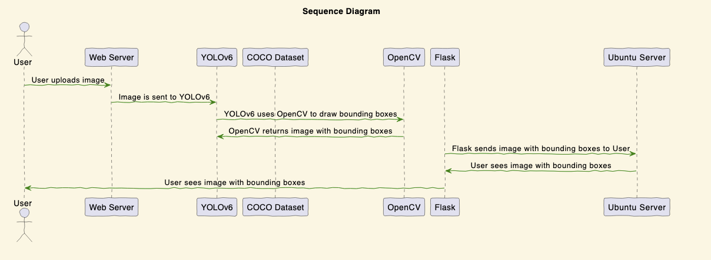

##### 
  

## Table of Contents
- [Description](#description)
- [Counting Students](#counting-students)
- [Stitching Images Together](#stitching-images-together)
- [Demo](#demo)
- [Sequence Diagram](#sequence-diagram)
- [Technologies](#technologies)
- [Authors](#authors)
- [Credits](#credits)

## Description
This is a research project for the course Computer Vision at the University of North Carolina in Charlotte. The goal of this project is to implement student counting using an image. The model that was used is YOLOv6 and the dataset used is the [COCO dataset](https://cocodataset.org/#home). The model was trained on Google Colab and the results were tested on a local machine. The model was trained on 100 epochs and the results were tested on 100 images. The results were not as expected and the model was not able to detect students in the images. The model was able to detect people in the images but not students. The model was able to detect students.

---

##### <a href="https://drive.google.com/file/d/1JD6vNxip-ClIy_E0Xozcf_Hlz6KXsxek/view">
  
</a>
---

##### <a href="https://docs.google.com/presentation/d/1KBtMGO36j1XabQgP3KVJK-smWe0HXILbsCPrjrXQbWE/edit#slide=id.g2968f33f89f_0_0">
  
</a>
---

#### Counting Students
---

####  Stitching Images Together 

---

## Demo
##### 

<a href="https://ml.anywhererpa.com">Demo</a>

##### 

<a href="https://cv.anywhererpa.com">Demo Backup Server</a>

---
## Sequence Diagram
##### 
  

## Technologies
- [Ubuntu Server 20.04 LTS](https://ubuntu.com/download/server)
- [Python 3.8.5](https://www.python.org/downloads/release/python-385/)
- [YOLOv6](https://github.com/meituan/YOLOv6)
- [COCO dataset](https://cocodataset.org/#home)
- [Flask](https://flask.palletsprojects.com/en/2.0.x/)
- [OpenCV](https://opencv.org/)
- [Stitching](https://github.com/OpenStitching/stitching)

---
## Authors
##### 
  

<table center>
  <thead allign=center>
    <tr>
      <th align=center > </th>
      <th align=center></th>
      <th align=center>  </th>
      <th align=center> </th>
      <th align=center>  </th>
    </tr>
  </thead>
  <tbody >
    <tr>
      <td>
        
      </td>
      <td>
        
      </td>
      <td>
        
      </td>
      <td>
        
      </td>
   <td>
        
      </td>
  

  </tbody>
</table>

## Credits
- [Research Paper](https://arxiv.org/abs/2301.05586)
- [Research Paper](https://arxiv.org/abs/2209.02976)
- [YOLOv6](https://github.com/meituan/YOLOv6)
- [COCO dataset](https://cocodataset.org/#home)
- [Stitiching Library](https://github.com/OpenStitching/stitching)
- [Stitching Paper For the Bonus](http://hdl.handle.net/20.500.11970/112696)

      @misc{li2022yolov6,
            title={YOLOv6: A Single-Stage Object Detection Framework for Industrial Applications}, 
            author={Chuyi Li and Lulu Li and Hongliang Jiang and Kaiheng Weng and Yifei Geng and Liang Li and Zaidan Ke and Qingyuan Li and Meng Cheng and Weiqiang Nie and Yiduo Li and Bo Zhang and Yufei Liang and Linyuan Zhou and Xiaoming Xu and Xiangxiang Chu and Xiaoming Wei and Xiaolin Wei},
            year={2022},
            eprint={2209.02976},
            archivePrefix={arXiv},
            primaryClass={cs.CV}
      }

      @misc{li2023yolov6,
            title={YOLOv6 v3.0: A Full-Scale Reloading}, 
            author={Chuyi Li and Lulu Li and Yifei Geng and Hongliang Jiang and Meng Cheng and Bo Zhang and Zaidan Ke and Xiaoming Xu and Xiangxiang Chu},
            year={2023},
            eprint={2301.05586},
            archivePrefix={arXiv},
            primaryClass={cs.CV}
      }

### Liberty, Equality, Fraternity
